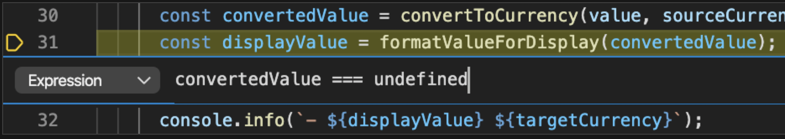

# Depuración interactiva de aplicaciones de Node.js

## Introduccion

> Capítulo 4: El Detective del Código

Javier se enfrenta a su primer bug crítico en UTOPIA. Usando las herramientas de depuración de VSCode, aprende a rastrear errores con precisión, encuentra un memory leak en una librería de compresión que había implementado mientras reorganizaba sus módulos.

Durante este proceso, accidentalmente, descubre un pequeño fallo de seguridad que podría haber tenido graves consecuencias.

---

## Objetivos de aprendizaje

Obtenga información sobre cómo depurar de forma eficaz la aplicación de Node.js con Visual Studio Code para corregir los errores rápidamente.

Al término de este módulo, podrá hacer lo siguiente:

- Usar el depurador de Visual Studio Code con un programa de Node.js.
- Crear puntos de interrupción y ejecutar el código paso a paso para detectar problemas
- Inspeccionar el estado del programa en cualquier paso de ejecución
- Rebobinar la pila de llamadas para buscar el origen de una excepción

## Contenido

- ** ¿Qué es un depurador?**
- ** Depuración con el depurador integrado de Node.js**
- ** Ejercicio: uso del depurador integrado de Node.js**
- ** Depuración con Visual Studio Code**
- ** Ejercicio: Depuración con Visual Studio Code**
- ** Prueba de conocimientos**

---

## ¿Qué es un depurador?

> Edsger Dijkstra dijo una vez:

"Si la depuración es el proceso de eliminar errores, la programación será el proceso de incluirlos".

Como desarrollador de ANFORA, seguramente escribirás muchos errores mientras programes, y eso está bien, porque es parte de la codificación y del proceso de aprendizaje, abraza tus errores y aprende de ellos.

Durante su trabajo como desarrollador, es inevitable que en algún momento se pregunte:

### ¿Por qué no funciona el código?

Durante su trabajo en la aplicación, lo más probable es que se enfrente a esta situación en varias ocasiones. Cuando se produce un error en un programa, cada persona aborda la situación de una manera diferente.

Este módulo es probablemente el más importante de aprender, aquí es donde realmente aprenderás a programar bien, ya que si consigues entender bien los errores como encontrarlos y solucionarlo, podrás enfrentarte a casi cualquier proyecto

Probablemente ya haya intentado uno o varios de estos enfoques de depuración:

- Intentar volver a ejecutar el programa, porque debería funcionar.
- Explique el problema a su compañero.
- Volver a leer el código para averiguar cuál es el problema.
- Ir a dar un paseo.
- Agregue unos cuantos console.log('here') en el código.
- Aunque es posible que estos métodos funcionen hasta cierto punto, hay otro enfoque que se considera más efectivo: usar un depurador. Pero ¿qué es un depurador exactamente?

**Un depurador es una herramienta de software que se usa para observar y controlar el flujo de ejecución de un programa desde una perspectiva analítica**. El objetivo de diseño consiste en detectar la causa principal de un error y ayudar a resolverlo. El depurador funciona hospedando el programa en su propio proceso de ejecución o ejecutándose como un proceso independiente asociado al programa en ejecución, como Node.js.

Hay diferentes variedades de depuradores. Algunos funcionan directamente desde la línea de comandos, mientras que otros tienen una interfaz gráfica de usuario. En este módulo, se usará el depurador de línea de comandos integrado en Node.js y el depurador gráfico integrado de Visual Studio Code.

## ¿Por qué usar un depurador?

Si no ejecuta el código a través de un depurador, significa que probablemente esté adivinando lo que ocurre en el programa. La principal ventaja de usar un depurador es que puede ver cómo se ejecuta el programa. Puede seguir línea a línea la ejecución del programa. De esta manera evitará equivocarse.

Cada depurador tiene su propio conjunto de características. Las dos características más importantes que se incluyen con casi todos los depuradores son las siguientes:

**Control de la ejecución del programa**

Puede pausar el programa y ejecutarlo paso a paso, lo que le permite ver qué código se ejecuta y cómo afecta al estado del programa.

**Observación del estado del programa**

Por ejemplo, puede examinar los valores de variable y los parámetros de función en cualquier momento durante la ejecución del código.

- Dominar un depurador hace que sea más eficaz en la búsqueda de errores en el código al ayudarle a comprender rápidamente cómo funciona un programa, es un reto y muchas veces la pereza nos aleja de usarlo.

## Depuración con el depurador integrado de Node.js

La depuración es una receta de varias fases que normalmente sigue estos pasos:

- Se identifica un error en el programa.
- Se busca dónde se encuentra el error en el código.
- Se analiza por qué se produce el error.
- Se corrige el error.
- Se comprueba que la corrección funciona.

Después de identificar un error en el programa de Node.js, el primer reto al que se enfrentará es descubrir dónde se encuentra el error en el código. Para lograrlo, una de las formas más eficaces consiste en ejecutar el código paso a paso para hacerse una idea de dónde se tuercen las cosas, teniendo siempre claro que se deben leer los logs de errores con rigor en caso de que existan.

### Puntos de interrupción

Es posible que la ejecución paso a paso de todo el código sea extremadamente ineficaz si el programa tiene miles de líneas de código. En ese caso, puede usar un punto de interrupción. Le permite interrumpir la ejecución normal del programa y hacer una pausa en un punto concreto del código.

Con los puntos de interrupción, puede hacer que el programa se ejecute con normalidad hasta llegar a la parte crítica donde sospecha que se encuentra el error. Después, puede cambiar a la ejecución paso a paso.

Hay varias maneras de definir puntos de interrupción en el código, en función del depurador y del editor de código.

**Modo de inspección de Node.js**

Como un depurador tiene acceso total al entorno de ejecución, un actor malintencionado también podría usarlo para insertar código arbitrario en la aplicación Node.js. Por ese motivo, de forma predeterminada, Node.js no permite depurar un programa en ejecución. Tendrá que habilitar un modo especial denominado modo inspector para permitir la depuración.

Debe iniciar la aplicación con la opción --inspect para permitir que un cliente depurador se asocie a la aplicación y tome el control de la ejecución de la aplicación.

De forma predeterminada, cuando se inicia Node.js con la opción --inspect, escucha en el host 127.0.0.1 en el puerto 9229. También puede especificar un host y un puerto personalizados mediante la sintaxis --inspect=<HOST>:<PORT>.

#### Importante

Evite enlazar el puerto del depurador de Node.js a una dirección IP pública o a 0.0.0.0. De lo contrario, cualquier cliente que pueda conectarse a la dirección IP podría conectarse y controlar la aplicación Node.js. De este modo, un atacante puede ejecutar de forma remota código arbitrario en el entorno de ejecución. Esta acción podría provocar una infracción de seguridad potencialmente grave.

Como alternativa, puede usar la opción --inspect-brk. Funciona igual que --inspect, pero interrumpe la ejecución del código justo antes de su inicio. Esto le permite adjuntar el depurador y tomarse su tiempo en establecer puntos de interrupción y recorrer el código para identificar la causa principal del problema. Use este modificador --inspect-brk cuando necesite depurar una condición de carrera(Problema intermitente que es difícil de reproducir).

Después de iniciar la aplicación con el modo de inspección habilitado, puede usar cualquier cliente del depurador compatible para conectarse al proceso de aplicación.

### Clientes de depurador

Para depurar la aplicación, debe usar un cliente de depurador. Un cliente de depurador es un programa que se conecta a la aplicación Node.js y le permite controlar su ejecución. Hay muchos clientes de depurador disponibles, pero los más comunes son:

- **Visual Studio Code:** Un cliente de depurador gráfico que viene incluido con Visual Studio Code. Úselo al depurar durante el desarrollo.
- **node-inspect:** Un cliente de depurador de línea de comando que viene incluido con Node.js. Úselo al depurar en producción.

- **Depurador integrado**: Puede usar node-inspect, un cliente de depurador de línea de comando, que viene incluido con Node.js, para depurar la aplicación Node.js. Es un depurador sencillo que permite establecer puntos de interrupción y ejecutar el código paso a paso.

```bash
node inspect <YOUR_SCRIPT>.js
```

El depurador de node-inspect ejecuta Node.js con el modo de inspección habilitado y se inicia al mismo tiempo que el depurador interactivo integrado. Pausa la ejecución justo antes de que se inicie el código. Debería ver el mensaje del depurador que indica que se ha iniciado correctamente.

```bash
node inspect myscript.js
< Debugger listening on ws://127.0.0.1:9229/ce3689fa-4433-41ee-9d5d-98b5bc5dfa27
< For help, see: https://nodejs.org/en/docs/inspector
< Debugger attached.
Break on start in myscript.js:1

> 1 const express = require('express');
> 2
> 3 const app = express();
> debug>
```

---

## Ejercicio: uso del depurador integrado de Node.js

Para poner en práctica los conceptos de depuración que acaba de aprender, creará una pequeña aplicación de Node.js para calcular el número N de la sucesión de Fibonacci.

La secuencia de Fibonacci es un conjunto de números que empiezan por el 0 y el 1, y cada uno de los siguientes es la suma de los dos números anteriores. La secuencia continúa de esta forma:

```bash
0, 1, 1, 2, 3, 5, 8, 13, 21...
```

- Compruebe que Node.js está instalado en el entorno:

```bash
node --version
```

### Preparación del entorno

Antes de profundizar en el ejercicio, debe preparar el código y el entorno.

Abra la subcarpeta `./workspace/core-node/code/nodejs-debug` y, a continuación, cree un archivo JavaScript denominado `myfibonacci.js`. El archivo que ya existe en la carpeta es una solución para el ejercicio, con la corrección necesaria para el error encontrado durante la depuración.

- Pegue este código en el archivo:

```js
function fibonacci(n) {
  let n1 = 0;
  let n2 = 1;
  let sum = 0;

  for (let i = 2; i < n; i++) {
    sum = n1 + n2;
    n1 = n2;
    n2 = sum;
  }

  return n === 0 ? n1 : n2;
}

const result = fibonacci(5);
console.log(result);
```

- Guarde el archivo, CTRL + S.

Haga clic con el botón derecho en la subcarpeta `./workspace/core-node/code/nodejs-debug y seleccione Open in integrated terminal y ejecute el programa mediante el comando siguiente:

```bash
node fibonacci.js
```

- La aplicación debería mostrar el resultado 3 (tres) en la consola.
- Por lo que parece hay un error, ya que se esperaba 5 (cinco) como resultado.
- Se usará el depurador integrado de Node.js para averiguar cuál es el problema.

## Hoja de referencia rápida de comandos del depurador

El depurador integrado Node.js incluye un conjunto de comandos que puede usar para controlar la ejecución del programa. Esta es una hoja de referencia rápida de los comandos más comunes:

| Comando     | Descripción                                                                                                                                                                                                                 |
| ----------- | --------------------------------------------------------------------------------------------------------------------------------------------------------------------------------------------------------------------------- |
| c           | Continúa la ejecución hasta el punto de interrupción siguiente o hasta el final del programa.                                                                                                                               |
| next        | Depurar paso a paso por **procedimientos**. Este comando es similar al comando step, con la diferencia de que si la siguiente línea de código es una llamada a una función, ejecuta la función sin entrar en ella.          |
| s           | Depura paso a paso por **instrucciones**. Este comando es similar al comandonext, con la diferencia de que si la siguiente línea de código es una llamada de función, va a la primera línea del código de esta función.     |
| sb()        | Agrega un punto de interrupción en la línea actual.                                                                                                                                                                         |
| exec <EXPR> | Evalúa una expresión en el contexto de ejecución actual. Este comando es útil para ayudarle a obtener información sobre el estado actual. Por ejemplo, puede obtener el valor de una variable denominada i mediante exec i. |
| Ctrl + D    | Detiene el depurador.                                                                                                                                                                                                       |

### Inicio del depurador integrado

Vuelva a iniciar el programa, esta vez con el depurador integrado habilitado.

- Escriba el siguiente comando en el terminal:

```bash
node inspect fibonacci.js
```

En el terminal, debería aparecer el símbolo del depurador. Ahora, recorra el código y ejecute el s + <Enter> paso a paso hasta que el punto de ejecución se encuentre al principio de la función fibonacci, de la siguiente manera:

```bash
break in fibonacci.js:2
1 function fibonacci(n) {

> 2 let n1 = 0;
> 3 let n2 = 1;
> 4 let sum = 0;
> debug>
```

> En este momento, se puede comprobar el valor del parámetro n que se ha pasado en la función si se ejecuta el comando siguiente:

```bash
exec n
```

En la consola debería aparecer 5 (cinco) como resultado. Avance paso a paso en el código y ejecute el comando s hasta que el punto de ejecución se encuentre al principio del bucle. Se necesitan cinco pasos con el comando s para llegar a este punto:

```bash
break in fibonacci.js:7
5
6 for (let i = 2; i < n; i++) {

> 7 sum = n1 + n2;
> 8 n1 = n2;
> 9 n2 = sum;
> debug>
```

> Nota

Es posible que haya observado que para desplazarse por la línea for(...) {} se necesitan varios comandos de depuración paso a paso por instrucciones. Esta situación se produce porque en esta línea hay varias instrucciones. Al realizar una depuración paso a paso, se pasa a la siguiente instrucción del código. Normalmente, hay una instrucción por línea. Si no es así, se necesitan varios pasos para ir a la línea siguiente.

### Detección del error con puntos de interrupción

Ahora vamos a agregar un punto de interrupción en esta línea para poder desplazarnos rápidamente por las iteraciones del bucle. En el terminal, escriba el siguiente comando:

```bash
sb()
```

Debería volver a ver las mismas líneas en la consola, lo que indica que en esta línea se ha establecido un punto de interrupción. Cuando el punto de ejecución actual se mueva, verá un asterisco \* en la línea en la que estableció el punto de interrupción.

Ejecute el comando c en el terminal para avanzar a la siguiente iteración del bucle:

```bash
c
```

Podemos comprobar el estado de iteración actual con el comando exec y ver el valor de varias variables mediante una matriz como parámetro de comando. Para ver los valores del iterador i y el total sum, usamos la sintaxis [i, sum]. Escriba el siguiente comando en el terminal:

```bash
exec [i, sum]
```

Debería ver el resultado [ 3, 1 ] en la consola.

El código aún no ha actualizado el valor de la variable sum para la iteración actual, que es 3 (tres). El valor de la variable sum todavía muestra el número de Fibonacci para la iteración anterior. Este es el cálculo que se usa en el código para obtener el valor actual sum:

```js
fibonacci(2) = fibonacci(0) + fibonacci(1)
= 0 + 1
= 1
```

En función de nuestro cálculo, parece que nuestro programa se ejecuta correctamente por ahora.

Continúe con la siguiente iteración de bucle ejecutando el comando c en el terminal y vuelva a comprobar el estado:

```bash
c
exec [i, sum]
```

Debería ver el resultado [ 4, 2 ] en la consola.

Ahora está en el punto justo antes del número de iteración que le interesa, que es 5 (cinco). Para ir con cuidado, avance paso a paso por esta iteración mediante el comando s. Intente alcanzar el punto de interrupción anterior, pero hágalo en pasos individuales. No vaya más allá del punto de interrupción.

### ¿Qué ha ocurrido?

Después de comprobar la condición de bucle i < n, la ejecución ha saltado repentinamente a la línea que tiene el comando return. Esto es lo que debería ver en el terminal:

```bash
break in fibonacci.js:12
10 }
11

> 12 return n === 0 ? n1 : n2;
> 13 }
> 14
```

> Ya está, hemos encontrado el error. En lugar de actualizar la suma de la iteración 5 (cinco), el código ha salido del bucle. Por ese motivo se ha obtenido el resultado de la iteración anterior 3 (tres) en la ejecución inicial.

Es necesario corregir la condición de bucle en el código de fibonacci.js. En el editor de código, cambie el valor de la instrucción Test de menor que < a menor o igual que <=:

```js
for (let i = 2; i <= n; i++) {
  sum = n1 + n2;
  n1 = n2;
  n2 = sum;
}
```

- Guarde los cambios en el editor de código.
- Salga del depurador usando Ctrl+D.
- Ahora, vuelva a ejecutar el programa en el terminal:

```bash
node fibonacci.js
```

Debería ver el resultado esperado en la consola, que es 5 (cinco).

Puede usar el depurador integrado de Node.js para aprender los principios básicos de depuración y realizar sesiones de depuración rápidas. Escribir los comandos puede ser aburrido, y podría ser demasiado limitado y difícil de usar con programas complejos.

En las secciones siguientes se verá cómo usar el depurador de Visual Studio Code en su lugar.

---

## Depuración con Visual Studio Code

En el ejercicio anterior, ha aprendido la importancia de poder ejecutar el código paso a paso con el depurador proporcionado en Node.js. Para su trabajo en la aplicación ANFORA, necesitará un entorno de depuración más completo dentro del IDE (entorno de desarrollo integrado).

Ahora verá cómo puede configurar el depurador de Visual Studio Code para usarlo con Node.js.

## Cómo usar Visual Studio Code para la depuración de Node.js

En Visual Studio Code, se accede al depurador desde la pestaña Ejecutar.


Si tiene abierto un archivo .js en la ventana del editor, seleccione `Ejecutar y depurar` y, a continuación, seleccione `Node.js` para depurar directamente el archivo JavaScript.


Hay otras maneras de iniciar la depuración en Visual Studio Code.

Para el ejercicio siguiente, usaremos un archivo launch.json. Los equipos de desarrollo suelen usar un archivo launch.json para personalizar la configuración de ejecución.

Con la configuración especificada en un archivo .json, puede comprobarla en el control de código fuente. Desde el control de código fuente, puede compartir la configuración en todo el equipo.

## Controlar el flujo agregando puntos de interrupción

A diferencia del depurador integrado de línea de comandos de Node.js, el de Visual Studio Code empieza de inmediato a ejecutar el código. Si el programa finaliza rápidamente, es posible que ni siquiera tenga la oportunidad de interactuar con el depurador.

Por esta razón, es posible que le interese agregar algunos puntos de interrupción antes de iniciar el código. Agregaremos y quitaremos algunos puntos de interrupción en el ejercicio siguiente.

Para agregar un punto de interrupción en el código, busque la línea de código en el archivo JavaScript (.js) donde quiere agregar una interrupción.

Junto al número de línea de la instrucción de código, seleccione el margen izquierdo.

Cuando se agregue el punto de interrupción, verá un círculo rojo junto al número de línea. Para quitar el punto de interrupción, seleccione el círculo rojo.


También puede usar el menú contextual con el botón derecho para agregar un punto de interrupción.

El menú de contenido incluye la opción Adición de un punto de interrupción condicional, donde se especifica una condición para interrumpir la ejecución del código.

Un punto de interrupción condicional solo estará activo cuando se cumpla la condición especificada.

Este punto de interrupción detiene la ejecución solo cuando el valor de convertedValue no está definido.



## Información general del depurador de Visual Studio Code

Después de configurar los puntos de interrupción e iniciar la aplicación, en la pantalla aparecen nuevos paneles de información y controles.


1. Controles de inicio del depurador: En la parte superior de la barra lateral, encontrará los controles de inicio.
2. Estado de las variables: El panel Variables muestra el estado actual de las variables.
3. Estado de las variables inspeccionadas: El panel Inspección muestra el estado actual de las variables inspeccionadas.
4. Pila de llamadas actual: El panel Pila de llamadas muestra la pila de llamadas actual.
5. Archivos de script cargados: En el panel Archivos de script cargados se muestran los archivos JavaScript que se han cargado hasta ahora.
6. Puntos de interrupción: El panel Puntos de interrupción muestra todos los puntos de interrupción que ha colocado en el código.
7. Controles de ejecución: Puede controlar el flujo de ejecución del programa mediante estos controles.
8. Paso de ejecución actual: El paso de ejecución actual está resaltado en la ventana del editor.
9. Consola de depuración: La Consola de depuración resulta útil para visualizar los registros de la consola de la aplicación y para evaluar expresiones o ejecutar código en el contexto de ejecución actual.

## Controles de inicio del depurador

En la parte superior de la barra lateral, encontrará los controles de inicio:


1. Inicie la depuración de la aplicación.
2. Seleccione la configuración de inicio activa
3. Edite el archivo launch.json. Cree el archivo json si es necesario.
4. Abra la Consola de depuración y active la visibilidad de los paneles Variables,

## Inspección, Pila de llamadas y Puntos de interrupción.

Visualización y edición del estado de las variables
Al analizar la causa de un defecto del programa, consulte el estado de las variables en busca de cambios inesperados. Puede usar el panel Variables para hacerlo.

- Las variables se muestran organizadas por ámbito:

### Local

- Las variables locales son aquellas a las que se puede acceder en el ámbito actual, normalmente la función actual.

### Global

- Las variables globales son aquellas a las que se puede acceder desde cualquier parte del programa. También se incluyen los objetos del sistema del entorno de ejecución de JavaScript, por lo que no debe sorprenderse si aquí ve una gran cantidad de elementos.

### Cierre o Closure

- Las variables de clausura son aquellas a las que se accede desde la clausura actual, si hay alguna. Una clausura combina el ámbito local de una función con el ámbito de la función externa a la que pertenece.

### Ambitos

Entre las posibles acciones se incluyen:

- Desplegar los ámbitos: Puede desplegar los ámbitos y las variables seleccionando la flecha. Al desplegar objetos, verá todas las propiedades definidas en este objeto.

- Cambiar el valor de una variable: Es posible cambiar el valor de una variable sobre la marcha haciendo doble clic en ella.

- Examinar una variable: Al mantener el puntero sobre un parámetro de función o una variable directamente en la ventana del editor, también podrá inspeccionar su valor.


### Inspección de variables

Si quiere realizar el seguimiento del estado de una variable en el tiempo o en distintas funciones, puede resultar tedioso hacer una búsqueda de cada vez. Por eso resulta tan útil el panel Inspección.


Puede seleccionar el botón más para escribir un nombre de variable o una expresión que quiera inspeccionar. Como alternativa, puede hacer clic con el botón derecho en una variable en el panel Variables y seleccionar Agregar a inspección.

Todas las expresiones que se encuentran dentro del panel de inspección se actualizarán automáticamente a medida que se ejecute el código.

### Pila de llamadas

Cada vez que el programa especifique una función, se agregará una entrada a la pila de llamadas. Cuando la aplicación se vuelva compleja y se llame a funciones dentro de otras funciones de forma repetida, la pila de llamadas representa el rastro de las llamadas a las funciones.

Esto resulta útil para buscar el origen de una excepción. Si se produce un bloqueo inesperado en el programa, verá algo parecido a esto en la consola:

```bash
/Users/learn/nodejs/index.js:22
return value.toFixed(2);
^
TypeError: Cannot read property 'toFixed' of undefined
at formatValueForDisplay (/Users/learn/nodejs/index.js:22:16)
at printForeignValues (/Users/learn/nodejs/index.js:31:28)
at Object.<anonymous> (/Users/learn/nodejs/index.js:39:1)
at Module.\_compile (internal/modules/cjs/loader.js:956:30)
at Object.Module.\_extensions..js (internal/modules/cjs/loader.js:973:10)
at Module.load (internal/modules/cjs/loader.js:812:32)
at Function.Module.\_load (internal/modules/cjs/loader.js:724:14)
at Function.Module.runMain (internal/modules/cjs/loader.js:1025:10)
at internal/main/run_main_module.js:17:11
```

El grupo de líneas at [...] situado debajo del mensaje de error se denomina seguimiento de la pila. Proporciona el nombre y el origen de cada función a la que se ha llamado antes de terminar con la excepción.

Pero puede ser algo difícil de descifrar, ya que también incluye funciones internas del entorno de ejecución de Node.js.

Aquí es donde resulta práctico el panel `Pila de llamadas de Visual Studio Code`.

Filtra la información no deseada y le muestra solo las funciones pertinentes de su código de forma predeterminada. Después, puede desenredar esta pila de llamadas para averiguar dónde se originó la excepción.

Para que le resulte todavía más fácil, puede seleccione el botón Reiniciar marco que aparece al mantener el puntero sobre el nombre de una función en la pila. La ejecución se retrasará hasta el principio de ese función y el programa se reiniciará en ese punto.


### Visualización de archivos de script cargados

En este panel se muestran todos los archivos de JavaScript que se hayan cargado hasta ahora. En proyectos de gran tamaño, a veces puede resultar útil comprobar a qué archivo pertenece el código que se ejecuta actualmente.

### Puntos de interrupción

En el panel Puntos de interrupción, puede ver todos los puntos de interrupción que haya colocado en el código y alternar entre ellos. También puede alternar entre las opciones para interrumpir las excepciones, tanto las detectadas como las no detectadas. Puede usar el panel Puntos de interrupción para examinar el estado del programa y localizar el origen de una excepción cuando se produzca mediante la pila de llamadas.

### Control de la ejecución

Puede controlar el flujo de ejecución del programa mediante estos controles.


Estos son los controles, de izquierda a derecha:

1. **Continuar o pausar la ejecución:** Si la ejecución está en pausa, continuará hasta que se alcance el siguiente punto de interrupción. Si el programa se está ejecutando, el botón se convertirá en un botón de pausa que puede usar para pausar la ejecución.

1. **Depurar paso a paso por procedimientos:** Ejecuta la siguiente instrucción de código en el contexto actual (igual que el comando next del depurador integrado).

1. **Depurar paso a paso por instrucciones:** Es igual que Depurar paso a paso por procedimientos, pero, si la siguiente instrucción es una llamada de función, pasa a la primera instrucción de código de esta función (igual que el comando step).

1. **Salir de la depuración:** Si está dentro de una función, ejecuta el código restante de esta y vuelve a la instrucción después de la llamada de función inicial (igual que el comando out).

1. **Reiniciar:** Reinicia el programa desde el principio.

1. **Detener:** Finaliza la ejecución y sale del depurador.

### Uso de la consola de depuración

Puede presionar Ctrl+Mayús+Y (Windows y Linux) o Cmd+Mayús+Y (Mac) para mostrar u ocultar la consola de depuración. Se puede usar para visualizar los registros de la consola de la aplicación y evaluar expresiones, así como ejecutar código en el contenido de ejecución actual, como el comando exec del depurador integrado de Node.js.

Puede escribir una expresión de JavaScript en el campo de entrada de la parte inferior de la consola de depuración. Después, presione Entrar para evaluarla. El resultado se muestra directamente en la consola.


De este modo, puede comprobar rápidamente el valor de una variable, probar una función con valores diferentes o modificar el estado actual.

### Agregar puntos de registro en lugar de console.log

Los linters marcarán las instrucciones console.log como errores. Para obtener el mismo efecto que las instrucciones console.log, use puntos de registro de Visual Studio Code en su lugar, que se imprimen en la consola de depuración.

Agregue un punto de registro haciendo clic con el botón derecho en la misma área que se usa para agregar un punto de interrupción y, a continuación seleccione Agregar punto de registro. Escriba un mensaje para que se muestre en ese punto del código.


Como sucede con los puntos de interrupción, los puntos de registro no modifican el código de ningún modo y solo se usan durante la depuración. Ya no tiene ninguna excusa para permitir que console.log('here') se use en producción.

---

## Ejercicio: Depuración con Visual Studio Code

Es el momento de poner en práctica todo lo que acaba de aprender sobre la depuración. De hecho, se nos ha presentado la ocasión perfecta. En la aplicación de ANFORA, se va a desarrollar una nueva característica que permite mostrar el precio de un producto en varias divisas. Un compañero de trabajo ha escrito un poco de código, pero le está costando detectar qué es lo que funciona mal. Hay que ayudarle.

Vamos!

## Creación de un archivo JavaScript en un área de trabajo de Visual Studio

Para este ejercicio, necesita un archivo JavaScript para practicar la depuración. Para usar los controles de inicio del depurador, el archivo JavaScript debe estar en un área de trabajo de Visual Studio.

El objetivo de la aplicación es establecer la tasa de cambio entre tres divisas: USD, EUR y JPY. Después, se quiere mostrar el valor de 10 EUR en todas las demás divisas, con dos dígitos después del separador decimal. Para cada divisa agregada, se debe calcular la tasa de cambio a todas las demás.

En Visual Studio Code, cree un archivo denominado mycurrency.js en la subcarpeta `./workspace/core-node/code/nodejs-debug/.

Pegue el siguiente código en el editor de nuevo archivo:

```js
const rates = {};

function setExchangeRate(rate, sourceCurrency, targetCurrency) {
if (rates[sourceCurrency] === undefined) {
rates[sourceCurrency] = {};
}

if (rates[targetCurrency] === undefined) {
rates[targetCurrency] = {};
}

rates[sourceCurrency][targetCurrency] = rate;
rates[targetCurrency][sourceCurrency] = 1 / rate;
}

function convertToCurrency(value, sourceCurrency, targetCurrency) {
const exchangeRate = rates[sourceCurrency][targetCurrency];
return exchangeRate && value \* exchangeRate;
}

function formatValueForDisplay(value) {
return value.toFixed(2);
}

function printForeignValues(value, sourceCurrency) {
console.info(`The value of ${value} ${sourceCurrency} is:`);

for (const targetCurrency in rates) {
if (targetCurrency !== sourceCurrency) {
const convertedValue = convertToCurrency(value, sourceCurrency, targetCurrency);
const displayValue = formatValueForDisplay(convertedValue);
console.info(`- ${convertedValue} ${targetCurrency}`);
}
}
}

setExchangeRate(0.88, 'USD', 'EUR');
setExchangeRate(107.4, 'USD', 'JPY');
printForeignValues(10, 'EUR');
```

Para guardar el archivo, presione Ctrl+S (Windows y Linux) o Cmd+S (Mac).

### Creación de una configuración de inicio

Como vamos a usar mucho el depurador, crearemos una configuración de inicio para la aplicación.

Vaya a la pestaña Ejecutar de Visual Studio Code, seleccione Crear un archivo launch.json y, después, seleccione el depurador Node.js.

Visual Studio Code crea el archivo de configuración .vscode/launch.json en la raíz del área de trabajo y abre el archivo de inicio para su edición.

De forma predeterminada, se crea una configuración de inicio para ejecutar el archivo que está abierto actualmente. En este ejemplo, el archivo abierto es mycurrency.js. Puede modificar la configuración de inicio para personalizar cómo se debe iniciar el programa al depurar.

En la configuración de inicio, vea el valor de la propiedad program.

```json
{
  // Use IntelliSense to learn about possible attributes.
  // Hover to view descriptions of existing attributes.
  // For more information, visit: https://go.microsoft.com/fwlink/?linkid=830387
  "version": "0.2.0",
  "configurations": [
    {
      "type": "node",
      "request": "launch",
      "name": "Launch Program",
      "skipFiles": ["<node_internals>/**"],
      "program": "${workspaceFolder}/core-node/code/nodejs-debug/mycurrency.js"
    }
  ]
}
```

- El texto ${workspaceFolder} indica la raíz del área de trabajo, fíjese bien en la ruta del programa que quiera depurar

- Cierre el archivo .vscode/launch.json.

> Nota

Para crear configuraciones de inicio diferentes del proyecto, seleccione Agregar configuración en la parte inferior derecha.

### Análisis de los problemas

Asegúrese de que el entorno de Visual Studio Code está listo para supervisar el proceso de depuración:

El panel del depurador debe estar abierto a la izquierda. Use el icono de pestaña Ejecutar de la izquierda para alternar la visibilidad del panel.

La consola de depuración debe estar abierta en la parte inferior. Para abrir la consola, seleccione Ver>Consola de depuración o pulse Ctrl+Shift+Y (Windows, Linux) o Cmd+Shift+Y (Mac).

De este modo, estará listo para iniciar la depuración.

En los controles de inicio del depurador, inicie el programa con la depuración habilitada (la flecha verde).


Debería ver que el programa finaliza rápidamente. Eso es normal porque todavía no ha agregado ningún punto de interrupción.

Debería ver este texto en la consola de depuración, seguido de una excepción.

```bash
The value of 10 EUR is:
11.363636363636365

- 11.363636363636365 USD
  /app/node-101/currency.js:23
  return value.toFixed(2);
  ^
  TypeError: Cannot read property 'toFixed' of undefined
  at formatValueForDisplay (/app/node-101/currency.js:23:16)
  at printForeignValues (/app/node-101/currency.js:32:28)
  at Object.<anonymous> (/app/node-101/currency.js:40:1)
  at Module.\_compile (internal/modules/cjs/loader.js:959:30)
  at Object.Module.\_extensions..js (internal/modules/cjs/loader.js:995:10)
  at Module.load (internal/modules/cjs/loader.js:815:32)
  at Function.Module.\_load (internal/modules/cjs/loader.js:727:14)
  at Function.Module.runMain (internal/modules/cjs/loader.js:1047:10)
  at internal/main/run_main_module.js:17:11
```

Lo que este programa pretende hacer es establecer la tasa de cambio entre tres divisas (USD, EUR y JPY) y mostrar el valor de 10 EUR en las demás divisas, con dos dígitos después del separador decimal.

Aquí se pueden ver dos errores:

- Hay más de dos dígitos después del separador decimal.

- El programa se ha bloqueado con una excepción y no ha mostrado el valor de JPY.

> Sugerencia

- Establezca "outputCapture": "std", en el archivo de configuración de inicio para aumentar la salida del registro.
- Establezca un punto de registro en lugar de un punto de interrupción para evitar detener la ejecución del programa. Un punto de registro no se "divide" en el depurador, sino que registra un mensaje en la consola.
- Los puntos de registro son especialmente útiles para insertar registros durante la depuración de servidores de producción que no se pueden pausar ni detener.

### Corrección de los dígitos mostrados

Para empezar, corregiremos el primer problema. Como no ha escrito este código y en él se llama a diferentes funciones, primero debe intentar entender el flujo de ejecución mediante la ejecución paso a paso.

### Uso de puntos de interrupción y de la ejecución paso a paso

Para agregar un punto de interrupción, haga clic en el margen izquierdo de la línea 39, en printForeignValues(10, 'EUR');.


Vuelva a iniciar la depuración y vaya a la función printForeignValues() con el control de depuración Depurar paso a paso por instrucciones:


### Comprobación del estado de las variables

Ahora dedique un tiempo a inspeccionar los diferentes valores de las variables en el panel Variables.


**¿Cuáles son los valores de las variables value y sourceCurrency?**

Para la variable rates, ¿ve las tres claves previstas, USD, EUR y JPY?

Para avanzar paso a paso hasta que se establezca la variable convertedValue, use el control de depuración Depurar paso a paso por procedimientos:


Después de usar el control Depurar paso a paso por procedimientos cinco veces, debería ver que el valor de la variable convertedValue se establece según lo esperado en 11.363636363636365.

Si realizamos una depuración paso a paso por procedimientos, veremos el valor de la variable displayValue. El valor debe ser la cadena con formato para mostrar con dos dígitos 11.36.

Llegados a este punto en el programa, podemos afirmar que las funciones convertToCurrency() y formatValueForDisplay() parecen correctas y devuelven el resultado esperado.

### Corrección del error

Use el control Depurar paso a paso por instrucciones una vez para llegar a la llamada a la función console.info(). Examine detenidamente esta línea de código. ¿Ve aquí el error?

Es necesario corregir este error de programa mediante la variable displayValue en lugar de la variable convertedValue para imprimir el valor.

Actualice el archivo currency.js para usar el nombre correcto de la variable. Cambie la llamada a la función console.info() en la línea 32 para usar la variable displayValue en lugar de la variable convertedValue:

```js
console.info(`- ${displayValue} ${targetCurrency}`);
```

- Guarde los cambios en el archivo.

- Reinicie el programa.

- Compruebe que el programa muestra correctamente el valor USD como 11.36.

> Primer error resuelto.

Come on!

### Detección de la causa del bloqueo

Veamos ahora por qué se bloquea el programa.

- En el archivo currency.js, quite el punto de interrupción que estableció en la línea 39.

Para obligar al programa a pausarse después de que se produzca una excepción, en el panel Puntos de interrupción.

- Active la casilla Excepciones no detectadas.

- Vuelva a ejecutar el programa en el depurador.

El programa se debería detener en la excepción y mostrar un extenso informe de errores en el centro de la ventana del editor.


Fíjese en la línea donde se detuvo la ejecución y observe el mensaje de excepción

```bash
TypeError: Cannot read property 'toFixed' of undefined.
```

A partir de ese mensaje, puede deducir que la función de parámetro value tiene el valor undefined en lugar de un número. Este error es lo que provocó la excepción.

### Rebobinado de la pila de llamadas

El seguimiento de la pila que aparece debajo del mensaje de error puede ser algo difícil de descifrar. La buena noticia es que Visual Studio Code procesa de forma automática la pila de llamadas de función. De forma predeterminada, solo muestra la información significativa en el panel Pila de llamadas. Vamos a usar la información de pila de llamadas para buscar el código que provocó esta excepción.

Sabemos que la excepción se produjo en la llamada a la función formatValueForDisplay().

- En el panel del depurador, vaya al panel Pila de llamadas.
- Haga doble clic en la función bajo ella: la función printForeignValues. Para ver dónde se llamó a la función formatValueForDisplay()

Visual Studio Code va a la línea de la función printForeignValues del archivo currency.js, donde se llamó a la función formatValueForDisplay():

```js
const displayValue = formatValueForDisplay(convertedValue);
```

- Examine detenidamente esta línea de código.

El parámetro que provoca la excepción proviene de la variable convertedValue. Tendrá que averiguar en qué punto este valor de parámetro se convierte en undefined.

Una opción consiste en agregar un punto de interrupción en esta línea e inspeccionar la variable cada vez el punto de interrupción se detenga en esta línea. Sin embargo, no sabemos cuándo puede producirse el valor incorrecto y, en programas complejos, este enfoque de depuración puede ser complicado. Echemos un vistazo a un método alternativo.

### Adición de un punto de interrupción condicional

Lo que sería útil en nuestro caso es poder detener el depurador en este punto de interrupción solo cuando el valor de la variable convertedValue es undefined. Afortunadamente, Visual Studio Code puede realizar esta acción con opciones de clic con el botón derecho del mouse.

En el archivo currency.js, en el margen izquierdo de la línea 31, haga clic con el botón derecho y seleccione Add Conditional Breakpoint (Agregar punto de interrupción condicional).


- Después de hacer clic con el botón derecho.

- Escriba la siguiente condición para desencadenar el punto de interrupción y presione Entrar:

```js
`convertedValue === undefined`;
```

- Reinicie el programa.

El programa debería detenerse ahora en la línea 31 y podemos examinar los valores de la pila de llamadas.

### Observación del estado actual

Dedique un tiempo a analizar el estado actual del programa.

El valor de la variable convertedValue procede de la llamada a la función convertToCurrency(value, sourceCurrency, targetCurrency). Es necesario comprobar los valores de parámetro en esta llamada de función y confirmar que son correctos.

En concreto, es necesario examinar la variable value y confirmar que tiene el valor esperado 10.

- Analice el código de la función convertToCurrency().

```js
function convertToCurrency(value, sourceCurrency, targetCurrency) {
const exchangeRate = rates[sourceCurrency][targetCurrency];
return exchangeRate && value \* exchangeRate;
}
```

Sabe que el resultado de este código es undefined. También sabe que la variable value está establecida en 10. Esta información nos ayuda a ver que el problema debe estar en el valor de la variable exchangeRate.

- En su archivo currency.js, mantenga el puntero sobre la variable rates para echar un vistazo:


La intención es obtener la tasa de cambio de EUR a JPY, pero, si despliega el valor EUR, verá que solo hay una tasa de conversión para USD. Falta la de JPY.

### Corrección de las tasas de conversión que faltan

Ahora que sabe que faltan algunas tasas de conversión, veremos los motivos. Para quitar todos los puntos de interrupción existentes, seleccione el icono Quitar todos los puntos de interrupción en el panel Puntos de interrupción.


### Inspección de la variable rates

Vamos a establecer un punto de interrupción para ver la variable rates.

- En el archivo currency.js, agregue un punto de interrupción en la línea 37 de la función setExchangeRate(0.88, 'USD', 'EUR');.

- En el panel Inspección, seleccione Más y escriba rates.

Cada vez que se cambia el valor de la variable rates, el valor actualizado se muestra en el panel Inspección.

- Reinicie el programa.

Cuando el punto de interrupción se detenga en la primera llamada a la función setExchangeRate(), use el control Paso a paso por procedimientos.

- En el panel Inspección, examine el valor de la variable rates.

En este momento, puede ver que USD y EUR tienen tasas de conversión opuestas coincidentes, como se esperaba.

- Realice el paso a paso por procedimiento de nuevo por la segunda llamada a la función setExchangeRate().

Verá que USD y JPY tienen tasas de conversión opuestas coincidentes, pero no hay nada entre EUR y JPY.

Ha llegado el momento de examinar el código de la función setExchangeRate().

```js
function setExchangeRate(rate, sourceCurrency, targetCurrency) {
  if (rates[sourceCurrency] === undefined) {
    rates[sourceCurrency] = {};
  }

  if (rates[targetCurrency] === undefined) {
    rates[targetCurrency] = {};
  }

  rates[sourceCurrency][targetCurrency] = rate;
  rates[targetCurrency][sourceCurrency] = 1 / rate;
}
```

Las líneas más importantes en esta función son las dos últimas. Ha encontrado el segundo error. Las tasas de conversión solo se establecen entre las variables sourceCurrency y targetCurrency. El programa también debe calcular la tasa de conversión para las otras divisas que se agregaron.

### Corrección del código

Vamos a corregir el código para el problema de tasa de conversión.

- Actualice el archivo currency.js para calcular la tasa de conversión de las otras divisas.

- Reemplace el código de las líneas 12 y 13:

```js
rates[sourceCurrency][targetCurrency] = rate;
rates[targetCurrency][sourceCurrency] = 1 / rate;
```

con este código actualizado:

```js
for (const currency in rates) {
if (currency !== targetCurrency) {
// Use a pivot rate for currencies that don't have the direct conversion rate
const pivotRate = currency === sourceCurrency ? 1 : rates[currency][sourceCurrency];
rates[currency][targetCurrency] = rate _ pivotRate;
rates[targetCurrency][currency] = 1 / (rate _ pivotRate);
}
}
```

- Guarde los cambios en el archivo.

El código actualizado establece la tasa de conversión para cualquier otra divisa que no sea sourceCurrency y targetCurrency. El programa utiliza la tasa de conversión de sourceCurrency para deducir la tasa entre la otra divisa y targetCurrency. A continuación, el código establece la tasa de conversión para la otra divisa en consecuencia.

> Nota

Esta corrección solo funciona si ya existen tasas entre sourceCurrency y otras divisas, lo que es una limitación aceptable en este caso.

### Prueba de la corrección

Vamos a probar el cambio que hemos realizado.

- Quite todos los puntos de interrupción y las variables de inspección.

- Reinicie el programa.

Ahora debería ver el resultado esperado en la consola, sin ningún bloqueo.

```bash
The value of 10 EUR is:

- 11.36 USD
- 1220.45 JPY
  Eso es todo. Ha corregido el código. Ahora puede depurar de forma eficaz código que ni siquiera conoce de antemano mediante Visual Studio Code. Buen trabajo.
```

---

### Prueba de conocimientos

1. ¿Cómo se ejecuta Node.js con el modo de inspección habilitado?

- [ ] Con el comando node inspect myscript.js.

- [ ] Con el comando node --inspect myscript.js.

- [ ] Se usa el comando `node myscript.js.

- [ ] Se escribe debug en REPL de Node.js.

2. ¿Cómo se puede hacer que un depurador pause la ejecución del programa en una línea de código específica?

- [ ] Se usa el comando node --inspect-brk myscript.js.

- [ ] Se ejecuta paso a paso el código hasta llegar a la línea deseada.

- [ ] Se convierte en comentario el código no deseado.

- [ ] Se establece un punto de interrupción en el código.

3. ¿Cuál es la mejor manera de imprimir información en la consola durante la depuración?

- [ ] Se establece un punto de interrupción.

- [ ] Se agrega una llamada a console.log() en el código.

- [ ] Se establece un punto de registro. CORRECTA A ESTUDIAR...

- [ ] Se inspecciona una variable.

---

## Resumen

Como desarrollador, lo más probable es que le interese pasar la mayor parte del tiempo codificando características nuevas, pero la detección y la corrección de errores a menudo interrumpirán esta tarea.

Como ya ha experimentado en esta lección, el uso de depuradores puede ser una estrategia eficaz para depurar los problemas de programas de Node.js. Tanto con el depurador integrado para sesiones rápidas como con el de Visual Studio Code para proyectos más complejos, ha aprendido a localizar y corregir los errores. Ha aprendido cómo puede depurar y encontrar errores incluso sin conocer el código de antemano.

> Capítulo 4: El Detective del Código

Javier, cual Sherlock Holmes del código, encuentra y soluciona su primer bug crítico. Casi sin querer, descubre una vulnerabilidad.

Investigando más, Javier descubre la potencia de GDB para analizar el comportamiento del código a bajo nivel(y depura la lib de compresion (xz https://en.wikipedia.org/wiki/XZ_Utils_backdoor) y se encuentra esta maravilla).

Esto despierta su curiosidad por la seguridad informática. Decide añadir una capa extra de seguridad a UTOPIA, no solo para proteger su proyecto, sino también para aprender más sobre hacking ético.

"¡Podría haber sido un desastre! Pero ha sido un eéxito!", piensa aliviado, mientras decide aprender más sobre seguridad informática, entendiendo que la vulnerabilidad fue puesta ahí a propósito… por un antiguo desarrollador de XZ, decide revisar el código de ANFORA. ¡A seguir depurando!
