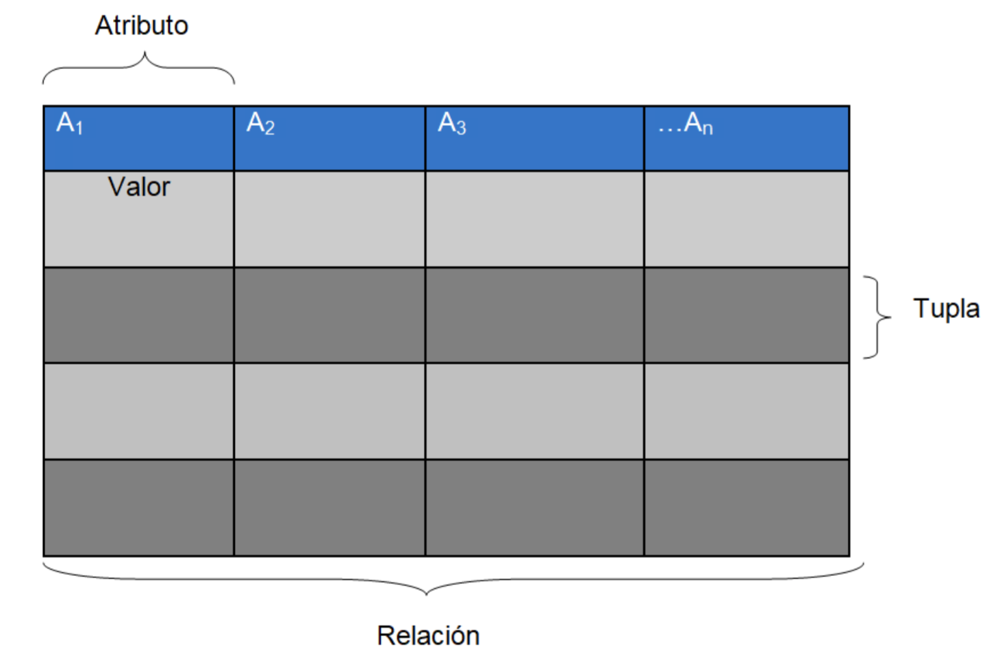

## Qué son las bases de datos

Conjunto de datos estructurados que pertenecen a un mismo contexto y, en cuanto a su función, se utiliza para administrar de forma electrónica grandes cantidades de información.
Ventajas:
- Acceso rápido
- Minimización de repetitividad
- Administración de datos ilimitados
- Acceso globalizado y centralizado
- Eficacio y eficencia

Las bases de datos se pueden clasificar según su organización. Nos vamos a centrar en la base de datos relacional ya que es de las más usadas en la actualidad por su dinamismo.

## Base de datos relacionales
Está caracterizada por su estructuración en tablas asociadas por relaciones bien definidas.
El modelo Entidad-Relación es la manera de representar gráficamente la estructura de este tipo de base de datos.

- La fila (**tupla**) es el conjunto de datos que representa un objeto simple.
- El nombre de cada columna (**atributo**) es un elemento etiquetado de una tupla.
- El nombre de cada tabla (**relación**) es el conjunto de tuplas que comparten los mismos atributos, es decir, es el conjunto de filas y columnas.

 

## Pasos para acceder a la base de datos desde consola
1. Tener en cuenta que como lo estamos haciendo a través de docker, lo primero es entrar a la consola propia del contenedor docker "postgres"

`docker exec -ti postgres_container bash` 

2. Si os fijáis, el color y el usuario de la consola ha cambiado, ahora es root, ya no es *user*. Esto nos indica que estamos dentro de la consola del docker. Es como si hubieramos abierto una terminal en nuestro ordenador. Ahora ya podemos conectarnos a la base de datos

psql -Upostgres postgres

3. Desde aquí ya se pueden lanzar los comandos sql

## Comandos consola Postgresql
- Para acceder a la base de datos → psql BASE_DE_DATOS -UNOMBRE_USUARIO
- Para ver la ayuda → \?
- Para ver la ayuda referente a las sentencias SQL → \h
- Para obtener información acerca de la conexión actual → \conninfo
- Para ver un listado con todas las tablas de la base base de datos → \dt
- Para ver un listado con todas las tablas, vistas y secuencias → \z
- Para salir de psql → \q

