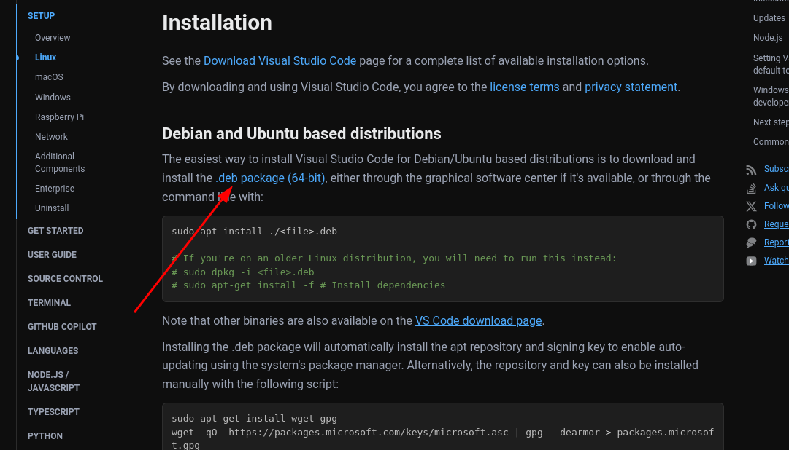

## Instalación de Visual Studio Code

Visual Studio Code es un editor de código fuente desarrollado por
Microsoft que se ha convertido en una de las herramientas más populares
para programar.
En este documento se detallan los pasos necesarios para instalar
Visual Studio Code en tu computadora.

Seguiremos las instrucciones de la documentación oficial de Visual Studio Code:
https://code.visualstudio.com/docs/setup/linux#_installation

1. Download the `.deb` package from the official website:

   

2. Install the package using the following command:

   ```bash
   sudo apt install ./<file>.deb
   ```
